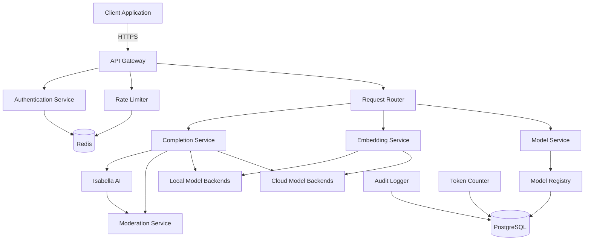
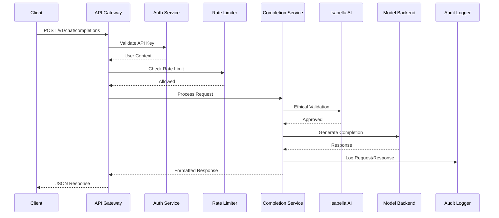

# Design Document: TAMVAI API

## Overview

The TAMVAI API is a sovereign artificial intelligence API that provides OpenAI-compatible endpoints while maintaining complete data sovereignty within TAMV infrastructure. The system is built as a TypeScript/Node.js microservice that integrates with the existing TAMV ecosystem, including the Isabella AI ethical system, and supports multiple AI model backends (local and cloud).

The design follows a layered architecture with clear separation of concerns:
- **API Gateway Layer**: Request validation, authentication, rate limiting
- **Service Layer**: Business logic for completions, embeddings, and model management
- **Integration Layer**: Connections to Isabella AI and model backends
- **Data Layer**: PostgreSQL for persistence, Redis for caching and rate limiting

This design prioritizes data sovereignty by defaulting to local model backends and only using cloud providers as fallback options with explicit audit logging.

## Architecture

### High-Level Architecture



### Component Interaction Flow



## Components and Interfaces

### 1. API Gateway

**Responsibility**: Entry point for all API requests, handles routing, validation, and middleware orchestration.

**Interface**:
```typescript
interface APIGateway {
  // Express app instance
  app: Express;
  
  // Middleware registration
  registerMiddleware(): void;
  registerRoutes(): void;
  
  // Health checks
  healthCheck(): Promise<HealthStatus>;
  readinessCheck(): Promise<ReadinessStatus>;
}

interface HealthStatus {
  status: 'healthy' | 'unhealthy';
  service: string;
  timestamp: string;
  dependencies: {
    postgres: boolean;
    redis: boolean;
    modelBackends: boolean;
  };
}
```

### 2. Authentication Service

**Responsibility**: Validates API keys, manages user permissions, and provides user context.

**Interface**:
```typescript
interface AuthenticationService {
  validateApiKey(apiKey: string): Promise<AuthResult>;
  createApiKey(userId: string, tier: ApiKeyTier): Promise<ApiKey>;
  revokeApiKey(apiKeyId: string): Promise<void>;
  getUserPermissions(apiKeyId: string): Promise<Permissions>;
}

interface AuthResult {
  valid: boolean;
  userId?: string;
  apiKeyId?: string;
  tier?: ApiKeyTier;
  permissions?: Permissions;
}

interface ApiKey {
  id: string;
  key: string; // Format: tamv-xxxxxxxxxxxxxxxxxxxx
  userId: string;
  tier: ApiKeyTier;
  createdAt: Date;
  expiresAt?: Date;
}

type ApiKeyTier = 'free' | 'basic' | 'premium' | 'enterprise';

interface Permissions {
  endpoints: string[];
  models: string[];
  maxTokensPerDay: number;
  maxRequestsPerMinute: number;
}
```

### 3. Rate Limiter

**Responsibility**: Enforces usage limits per API key using Redis for distributed rate limiting.

**Interface**:
```typescript
interface RateLimiter {
  checkRateLimit(apiKeyId: string, tier: ApiKeyTier): Promise<RateLimitResult>;
  incrementUsage(apiKeyId: string, tokens: number): Promise<void>;
  getRemainingQuota(apiKeyId: string): Promise<QuotaInfo>;
}

interface RateLimitResult {
  allowed: boolean;
  retryAfter?: number; // seconds until reset
  remaining: number;
  limit: number;
  resetAt: Date;
}

interface QuotaInfo {
  requestsPerMinute: {
    used: number;
    limit: number;
    resetAt: Date;
  };
  tokensPerDay: {
    used: number;
    limit: number;
    resetAt: Date;
  };
}
```

### 4. Request Router

**Responsibility**: Routes requests to appropriate service handlers based on endpoint and model availability.

**Interface**:
```typescript
interface RequestRouter {
  route(request: APIRequest): Promise<ServiceHandler>;
  getModelBackend(modelId: string): Promise<ModelBackend>;
}

interface APIRequest {
  endpoint: string;
  method: string;
  body: any;
  headers: Record<string, string>;
  userId: string;
  apiKeyId: string;
}

type ServiceHandler = CompletionService | EmbeddingService | ModelService;
```

### 5. Completion Service

**Responsibility**: Handles chat completion requests, integrates with Isabella AI for ethical validation.

**Interface**:
```typescript
interface CompletionService {
  createChatCompletion(request: ChatCompletionRequest): Promise<ChatCompletionResponse>;
  createStreamingCompletion(request: ChatCompletionRequest): AsyncGenerator<ChatCompletionChunk>;
}

interface ChatCompletionRequest {
  model: string;
  messages: Message[];
  temperature?: number;
  max_tokens?: number;
  top_p?: number;
  frequency_penalty?: number;
  presence_penalty?: number;
  stream?: boolean;
  user?: string;
}

interface Message {
  role: 'system' | 'user' | 'assistant';
  content: string;
}

interface ChatCompletionResponse {
  id: string;
  object: 'chat.completion';
  created: number;
  model: string;
  choices: Choice[];
  usage: Usage;
}

interface Choice {
  index: number;
  message: Message;
  finish_reason: 'stop' | 'length' | 'content_filter' | 'null';
}

interface Usage {
  prompt_tokens: number;
  completion_tokens: number;
  total_tokens: number;
}
```

### 6. Embedding Service

**Responsibility**: Generates vector embeddings for text inputs.

**Interface**:
```typescript
interface EmbeddingService {
  createEmbedding(request: EmbeddingRequest): Promise<EmbeddingResponse>;
}

interface EmbeddingRequest {
  model: string;
  input: string | string[];
  user?: string;
}

interface EmbeddingResponse {
  object: 'list';
  data: EmbeddingData[];
  model: string;
  usage: Usage;
}

interface EmbeddingData {
  object: 'embedding';
  embedding: number[];
  index: number;
}
```

### 7. Model Service

**Responsibility**: Manages model registry and provides model information.

**Interface**:
```typescript
interface ModelService {
  listModels(): Promise<ModelList>;
  getModel(modelId: string): Promise<Model>;
  registerModel(config: ModelConfig): Promise<void>;
  updateModelStatus(modelId: string, status: ModelStatus): Promise<void>;
}

interface ModelList {
  object: 'list';
  data: Model[];
}

interface Model {
  id: string;
  object: 'model';
  created: number;
  owned_by: string;
  capabilities: ModelCapabilities;
  status: ModelStatus;
}

interface ModelCapabilities {
  chat_completion: boolean;
  embeddings: boolean;
  max_tokens: number;
  context_window: number;
}

type ModelStatus = 'available' | 'unavailable' | 'degraded';
```

### 8. Isabella AI Integration

**Responsibility**: Provides ethical validation and content moderation using Isabella AI system.

**Interface**:
```typescript
interface IsabellaAIIntegration {
  validateContent(content: string, context: UserContext): Promise<ValidationResult>;
  moderateResponse(response: string, context: UserContext): Promise<ModerationResult>;
  getEthicalGuidance(scenario: string): Promise<EthicalGuidance>;
}

interface UserContext {
  userId: string;
  conversationHistory?: Message[];
  preferences?: UserPreferences;
}

interface ValidationResult {
  approved: boolean;
  confidence: number;
  requiresHumanReview: boolean;
  explanation?: string;
  violations?: string[];
}

interface ModerationResult {
  safe: boolean;
  categories: {
    hate: boolean;
    violence: boolean;
    sexual: boolean;
    self_harm: boolean;
    unethical: boolean;
  };
  explanation?: string;
}

interface EthicalGuidance {
  recommendation: string;
  reasoning: string;
  confidence: number;
}
```

### 9. Model Backend Interface

**Responsibility**: Abstraction for different AI model providers (local and cloud).

**Interface**:
```typescript
interface ModelBackend {
  name: string;
  type: 'local' | 'cloud';
  
  generateCompletion(request: CompletionRequest): Promise<CompletionResult>;
  generateEmbedding(request: EmbeddingRequest): Promise<EmbeddingResult>;
  healthCheck(): Promise<boolean>;
}

interface CompletionRequest {
  model: string;
  prompt: string;
  temperature: number;
  max_tokens: number;
  top_p: number;
}

interface CompletionResult {
  text: string;
  tokens: number;
  finishReason: string;
}

interface EmbeddingResult {
  embedding: number[];
  tokens: number;
}
```

### 10. Audit Logger

**Responsibility**: Records all API requests and responses for compliance and debugging.

**Interface**:
```typescript
interface AuditLogger {
  logRequest(entry: AuditEntry): Promise<void>;
  queryLogs(query: LogQuery): Promise<AuditEntry[]>;
}

interface AuditEntry {
  id: string;
  timestamp: Date;
  apiKeyId: string;
  userId: string;
  endpoint: string;
  method: string;
  requestBody: any;
  responseStatus: number;
  responseBody?: any;
  tokensUsed: number;
  processingTimeMs: number;
  modelBackend: string;
  error?: string;
  ethicalFlags?: string[];
}

interface LogQuery {
  apiKeyId?: string;
  userId?: string;
  startDate?: Date;
  endDate?: Date;
  endpoint?: string;
  limit?: number;
  offset?: number;
}
```

### 11. Token Counter

**Responsibility**: Counts tokens for billing and rate limiting using model-specific tokenizers.

**Interface**:
```typescript
interface TokenCounter {
  countTokens(text: string, model: string): Promise<number>;
  recordUsage(apiKeyId: string, tokens: number, model: string): Promise<void>;
  getUsageStats(apiKeyId: string, dateRange: DateRange): Promise<UsageStats>;
}

interface DateRange {
  start: Date;
  end: Date;
}

interface UsageStats {
  totalTokens: number;
  byModel: Record<string, number>;
  byDate: Record<string, number>;
  cost: number;
}
```

### 12. Fallback Handler

**Responsibility**: Implements retry logic and automatic failover to backup model backends.

**Interface**:
```typescript
interface FallbackHandler {
  executeWithFallback<T>(
    operation: () => Promise<T>,
    fallbacks: ModelBackend[]
  ): Promise<T>;
}

interface RetryConfig {
  maxRetries: number;
  initialDelayMs: number;
  maxDelayMs: number;
  backoffMultiplier: number;
}
```

## Data Models

### Database Schema (PostgreSQL)

```sql
-- API Keys table
CREATE TABLE api_keys (
  id UUID PRIMARY KEY DEFAULT gen_random_uuid(),
  key_hash VARCHAR(255) NOT NULL UNIQUE,
  user_id UUID NOT NULL,
  tier VARCHAR(50) NOT NULL,
  created_at TIMESTAMP NOT NULL DEFAULT NOW(),
  expires_at TIMESTAMP,
  revoked_at TIMESTAMP,
  last_used_at TIMESTAMP,
  INDEX idx_key_hash (key_hash),
  INDEX idx_user_id (user_id)
);

-- Users table
CREATE TABLE users (
  id UUID PRIMARY KEY DEFAULT gen_random_uuid(),
  email VARCHAR(255) NOT NULL UNIQUE,
  name VARCHAR(255),
  created_at TIMESTAMP NOT NULL DEFAULT NOW(),
  updated_at TIMESTAMP NOT NULL DEFAULT NOW()
);

-- Permissions table
CREATE TABLE permissions (
  id UUID PRIMARY KEY DEFAULT gen_random_uuid(),
  api_key_id UUID NOT NULL REFERENCES api_keys(id),
  endpoint VARCHAR(255) NOT NULL,
  allowed BOOLEAN NOT NULL DEFAULT true,
  created_at TIMESTAMP NOT NULL DEFAULT NOW()
);

-- Models table
CREATE TABLE models (
  id VARCHAR(255) PRIMARY KEY,
  name VARCHAR(255) NOT NULL,
  owned_by VARCHAR(255) NOT NULL,
  backend_type VARCHAR(50) NOT NULL,
  backend_url VARCHAR(500),
  capabilities JSONB NOT NULL,
  status VARCHAR(50) NOT NULL,
  created_at TIMESTAMP NOT NULL DEFAULT NOW(),
  updated_at TIMESTAMP NOT NULL DEFAULT NOW()
);

-- Audit logs table
CREATE TABLE audit_logs (
  id UUID PRIMARY KEY DEFAULT gen_random_uuid(),
  timestamp TIMESTAMP NOT NULL DEFAULT NOW(),
  api_key_id UUID NOT NULL REFERENCES api_keys(id),
  user_id UUID NOT NULL REFERENCES users(id),
  endpoint VARCHAR(255) NOT NULL,
  method VARCHAR(10) NOT NULL,
  request_body JSONB,
  response_status INTEGER NOT NULL,
  response_body JSONB,
  tokens_used INTEGER NOT NULL,
  processing_time_ms INTEGER NOT NULL,
  model_backend VARCHAR(255),
  error TEXT,
  ethical_flags JSONB,
  INDEX idx_api_key_id (api_key_id),
  INDEX idx_user_id (user_id),
  INDEX idx_timestamp (timestamp),
  INDEX idx_endpoint (endpoint)
);

-- Token usage table
CREATE TABLE token_usage (
  id UUID PRIMARY KEY DEFAULT gen_random_uuid(),
  api_key_id UUID NOT NULL REFERENCES api_keys(id),
  model VARCHAR(255) NOT NULL,
  tokens INTEGER NOT NULL,
  cost DECIMAL(10, 6) NOT NULL,
  timestamp TIMESTAMP NOT NULL DEFAULT NOW(),
  INDEX idx_api_key_id (api_key_id),
  INDEX idx_timestamp (timestamp)
);
```

### Redis Data Structures

```typescript
// Rate limiting keys
// Format: ratelimit:requests:{apiKeyId}:{minute}
// Value: count of requests in that minute
// TTL: 60 seconds

// Format: ratelimit:tokens:{apiKeyId}:{date}
// Value: count of tokens used that day
// TTL: 24 hours

// API key cache
// Format: apikey:{keyHash}
// Value: JSON serialized ApiKey object
// TTL: 5 minutes

// Model status cache
// Format: model:status:{modelId}
// Value: ModelStatus enum value
// TTL: 1 minute
```

### Configuration Format

```typescript
interface TAMVAIConfig {
  server: {
    port: number;
    host: string;
    corsOrigins: string[];
  };
  
  database: {
    url: string;
    poolSize: number;
  };
  
  redis: {
    url: string;
  };
  
  models: ModelConfig[];
  
  rateLimits: {
    free: RateLimitConfig;
    basic: RateLimitConfig;
    premium: RateLimitConfig;
    enterprise: RateLimitConfig;
  };
  
  isabella: {
    enabled: boolean;
    endpoint: string;
    apiKey: string;
  };
  
  dataSovereignty: {
    preferLocalModels: boolean;
    allowCloudFallback: boolean;
    auditExternalRequests: boolean;
  };
}

interface ModelConfig {
  id: string;
  name: string;
  backend: 'ollama' | 'lmstudio' | 'vllm' | 'openai' | 'anthropic';
  endpoint: string;
  apiKey?: string;
  capabilities: ModelCapabilities;
  priority: number; // Lower = higher priority
  enabled: boolean;
}

interface RateLimitConfig {
  requestsPerMinute: number;
  tokensPerDay: number;
}
```


## Correctness Properties

*A property is a characteristic or behavior that should hold true across all valid executions of a system—essentially, a formal statement about what the system should do. Properties serve as the bridge between human-readable specifications and machine-verifiable correctness guarantees.*

### Property 1: OpenAI Format Compatibility

*For any* valid OpenAI API request (chat completions, embeddings, or models list), the TAMVAI API SHALL accept the request and return a response that exactly matches OpenAI's response structure, including all required fields and data types.

**Validates: Requirements 1.1, 1.2, 1.3, 1.7**

### Property 2: Request Validation and Error Reporting

*For any* malformed request (invalid JSON, missing required fields, or invalid structure), the API SHALL return a 400 Bad Request error with a descriptive message that specifies the validation failure.

**Validates: Requirements 1.4, 1.5, 1.6**

### Property 3: API Key Authentication Flow

*For any* request with an API key, if the key is valid and not revoked, the Authentication Service SHALL retrieve the associated user context and permissions; if the key is invalid, missing, or revoked, the service SHALL return a 401 Unauthorized error.

**Validates: Requirements 2.1, 2.2, 2.3, 2.6**

### Property 4: API Key Format and Security

*For any* API key in the system, it SHALL match the format `tamv-xxxxxxxxxxxxxxxxxxxx`, be generated using cryptographically secure randomness, and be stored as a bcrypt hash with salt rounds >= 12.

**Validates: Requirements 2.4, 2.5, 2.7**

### Property 5: Rate Limiting Enforcement

*For any* authenticated request, if the API key has not exceeded its tier-based rate limits (requests per minute and tokens per day), the request SHALL be allowed; if limits are exceeded, the service SHALL return a 429 Too Many Requests error with a Retry-After header indicating seconds until reset.

**Validates: Requirements 3.1, 3.2, 3.3, 3.4, 3.5**

### Property 6: Rate Limit TTL Management

*For any* rate limit data stored in Redis, the system SHALL set appropriate TTL values (60 seconds for per-minute counters, 24 hours for daily counters) to ensure automatic cleanup.

**Validates: Requirements 3.7**

### Property 7: Model Registry Completeness

*For any* model in the Model Registry, it SHALL include all required metadata: model ID, owner, creation timestamp, capabilities (chat_completion, embeddings, max_tokens, context_window), and current health status.

**Validates: Requirements 4.1, 8.2, 8.3, 8.4, 8.6**

### Property 8: Model Routing and Availability

*For any* request specifying a model, if the model exists and is healthy, the Request Router SHALL route to the appropriate backend; if the model does not exist or is unhealthy, the router SHALL return a 404 error with a list of available models.

**Validates: Requirements 4.2, 4.3, 8.7**

### Property 9: Fallback and Retry Logic

*For any* request to a model backend, if the primary backend fails, the Fallback Handler SHALL automatically retry with the next available backup backend using exponential backoff; if all backends fail, the system SHALL return a 503 Service Unavailable error.

**Validates: Requirements 4.6, 11.1, 11.2, 11.5**

### Property 10: Isabella AI Integration

*For any* chat completion request, the system SHALL integrate with Isabella AI for ethical validation, pass user context for personalization, and include confidence metrics in the response metadata; if Isabella AI detects inappropriate content, the request SHALL be rejected with an explanation.

**Validates: Requirements 5.1, 5.2, 5.4, 5.5**

### Property 11: Ethical Audit Logging

*For any* request that Isabella AI flags for human review or ethical violations, the Audit Logger SHALL record the flag details in the audit log entry.

**Validates: Requirements 5.3, 10.7**

### Property 12: Chat Completion Parameters

*For any* chat completion request, the system SHALL accept and process the messages array (with role and content fields), support optional parameters (temperature, max_tokens, top_p, frequency_penalty, presence_penalty), and support system messages for instruction-following.

**Validates: Requirements 6.2, 6.3, 6.7**

### Property 13: Chat Completion Response Format

*For any* non-streaming chat completion request, the response SHALL include all required fields (id, object, created, model, choices array, usage statistics with prompt_tokens, completion_tokens, and total_tokens).

**Validates: Requirements 6.1, 6.5, 6.6**

### Property 14: Streaming Response Format

*For any* streaming chat completion request (stream: true), the system SHALL return Server-Sent Events where each event has a `data:` prefix with delta content, and the stream SHALL terminate with a `[DONE]` message after sending a final chunk containing the finish_reason.

**Validates: Requirements 6.4, 13.1, 13.2, 13.3, 13.4, 13.5**

### Property 15: Streaming Error Handling

*For any* streaming request that encounters an error, the system SHALL send an error event in SSE format before closing the stream.

**Validates: Requirements 13.7**

### Property 16: Embedding Input Flexibility

*For any* embedding request, the system SHALL accept either a single string or an array of strings as input and generate corresponding embeddings.

**Validates: Requirements 7.1, 7.2**

### Property 17: Embedding Response Format

*For any* embedding request, the response SHALL match OpenAI's format with embedding vectors, include token usage statistics, and normalize all embedding vectors to unit length.

**Validates: Requirements 7.3, 7.5, 7.7**

### Property 18: Data Sovereignty Priority

*For any* request requiring model inference, if local models are available and healthy, the Request Router SHALL prioritize them over cloud providers; cloud providers SHALL only be used when explicitly configured or as fallback when local models are unavailable.

**Validates: Requirements 9.1, 9.2**

### Property 19: External Request Auditing

*For any* request routed to a cloud provider backend, the Data Sovereignty Layer SHALL log and audit the external request in the audit log with full details.

**Validates: Requirements 9.3**

### Property 20: Sensitive Data Protection

*For any* request containing sensitive data (as defined by data classification rules), the Data Sovereignty Layer SHALL prevent transmission to external providers and return an error or route to local models only.

**Validates: Requirements 9.7**

### Property 21: Comprehensive Audit Logging

*For any* request processed by the API, the Audit Logger SHALL record a complete audit entry including timestamp, API key ID, user ID, endpoint, method, request body, response status, response body, tokens used, processing time, model backend used, and any errors or ethical flags.

**Validates: Requirements 10.1, 10.2, 10.3, 10.4**

### Property 22: Audit Log Querying

*For any* audit log query with filters (API key, user ID, date range, endpoint), the system SHALL return all matching audit entries within the specified criteria.

**Validates: Requirements 10.6**

### Property 23: Error Response Format Consistency

*For any* error condition (timeout, backend failure, validation error, rate limit), the system SHALL return an error response in OpenAI-compatible format with appropriate HTTP status code (400, 401, 404, 429, 503, 504), error type, and descriptive message.

**Validates: Requirements 11.3, 11.4**

### Property 24: Request ID Traceability

*For any* response (success or error), the system SHALL include a unique request_id for debugging and tracing.

**Validates: Requirements 11.6**

### Property 25: Error Sanitization

*For any* internal error, the system SHALL log full error details (including stack traces) in the audit log but return only sanitized error information to the client without exposing internal implementation details.

**Validates: Requirements 11.7**

### Property 26: Token Counting Accuracy

*For any* completion or embedding request, the Token Counter SHALL count input and output tokens using the model-specific tokenizer and include accurate token counts (prompt_tokens, completion_tokens, total_tokens) in the response.

**Validates: Requirements 12.1, 12.2, 12.5**

### Property 27: Token Usage Persistence

*For any* request that consumes tokens, the Token Counter SHALL persist the usage data (API key ID, model, token count, cost, timestamp) in PostgreSQL for billing and analytics.

**Validates: Requirements 12.3**

### Property 28: Usage Statistics Querying

*For any* usage query with API key and date range, the system SHALL return aggregated statistics including total tokens, breakdown by model, breakdown by date, and total cost.

**Validates: Requirements 12.4**

### Property 29: Token Limit Warnings

*For any* API key approaching its daily token limit (e.g., >90% used), the Rate Limiter SHALL include warning headers in responses before enforcing hard limits.

**Validates: Requirements 12.6**

### Property 30: Model-Specific Token Costs

*For any* token usage calculation, the Token Counter SHALL apply the correct per-token cost based on the model used, supporting different pricing for different models.

**Validates: Requirements 12.7**

### Property 31: Health Check Dependency Validation

*For any* health check request, the system SHALL verify connectivity to all critical dependencies (PostgreSQL, Redis, model backends) and return 200 OK only when all dependencies are healthy; if any dependency is unhealthy, return 503 Service Unavailable with details.

**Validates: Requirements 14.2, 14.3, 14.4**

### Property 32: Health Check Metrics

*For any* health check response, the system SHALL include response time metrics for each dependency check.

**Validates: Requirements 14.5**

### Property 33: Dynamic Model Configuration

*For any* model configuration change (adding, removing, enabling, disabling models), the Model Registry SHALL apply the changes without requiring service restart and validate all configurations before applying them.

**Validates: Requirements 15.1, 15.2, 15.3, 15.4**

### Property 34: Weighted Model Routing

*For any* model with multiple backends configured with routing weights, the Request Router SHALL distribute requests according to the specified weights to support A/B testing.

**Validates: Requirements 15.5**

### Property 35: Model Parameter Enforcement

*For any* request with parameters (temperature, max_tokens), the system SHALL enforce model-specific limits defined in the configuration and reject requests that exceed those limits.

**Validates: Requirements 15.6**

### Property 36: Configuration Error Recovery

*For any* configuration reload that fails validation, the system SHALL log the validation errors and continue using the previous valid configuration without disrupting service.

**Validates: Requirements 15.7**

## Error Handling

### Error Categories

1. **Client Errors (4xx)**
   - 400 Bad Request: Invalid JSON, missing required fields, invalid parameters
   - 401 Unauthorized: Invalid or missing API key
   - 404 Not Found: Model not found, endpoint not found
   - 429 Too Many Requests: Rate limit exceeded

2. **Server Errors (5xx)**
   - 500 Internal Server Error: Unexpected errors (sanitized for client)
   - 503 Service Unavailable: All backends unavailable, dependencies unhealthy
   - 504 Gateway Timeout: Backend timeout

### Error Response Format

All errors follow OpenAI's error format:

```typescript
interface ErrorResponse {
  error: {
    message: string;
    type: string;
    param?: string;
    code?: string;
  };
}
```

### Error Handling Strategy

1. **Validation Errors**: Caught early at API Gateway, return 400 with specific field errors
2. **Authentication Errors**: Return 401 immediately, no retry
3. **Rate Limit Errors**: Return 429 with Retry-After header
4. **Backend Errors**: Trigger fallback handler, retry with exponential backoff
5. **Timeout Errors**: Return 504 after configured timeout threshold
6. **Internal Errors**: Log full details, return sanitized 500 to client

### Retry Logic

- **Exponential Backoff**: Initial delay 100ms, max delay 5s, multiplier 2x
- **Max Retries**: 3 attempts per backend
- **Fallback Chain**: Local models → Cloud providers (if configured)
- **Circuit Breaker**: Temporarily skip backends with high failure rates

## Testing Strategy

### Dual Testing Approach

The TAMVAI API requires both unit testing and property-based testing for comprehensive coverage:

- **Unit Tests**: Verify specific examples, edge cases, and error conditions
- **Property Tests**: Verify universal properties across all inputs using randomized testing

Both approaches are complementary and necessary. Unit tests catch concrete bugs in specific scenarios, while property tests verify general correctness across a wide range of inputs.

### Property-Based Testing Configuration

**Library**: We will use `fast-check` for TypeScript property-based testing.

**Configuration**:
- Minimum 100 iterations per property test (due to randomization)
- Each property test must reference its design document property
- Tag format: `// Feature: tamvai-api, Property {number}: {property_text}`

**Example Property Test Structure**:

```typescript
import fc from 'fast-check';

describe('TAMVAI API Properties', () => {
  // Feature: tamvai-api, Property 1: OpenAI Format Compatibility
  it('should accept valid OpenAI chat completion requests', () => {
    fc.assert(
      fc.property(
        fc.record({
          model: fc.constantFrom('gpt-3.5-turbo', 'gpt-4'),
          messages: fc.array(fc.record({
            role: fc.constantFrom('system', 'user', 'assistant'),
            content: fc.string()
          }), { minLength: 1 })
        }),
        async (request) => {
          const response = await apiGateway.post('/v1/chat/completions', request);
          expect(response.status).toBe(200);
          expect(response.body).toHaveProperty('id');
          expect(response.body).toHaveProperty('choices');
          expect(response.body).toHaveProperty('usage');
        }
      ),
      { numRuns: 100 }
    );
  });
});
```

### Unit Testing Focus Areas

Unit tests should focus on:

1. **Specific Examples**: Concrete test cases that demonstrate correct behavior
2. **Edge Cases**: Empty inputs, maximum values, boundary conditions
3. **Error Conditions**: Specific error scenarios and their expected responses
4. **Integration Points**: Interactions between components (mocked dependencies)

**Example Unit Test**:

```typescript
describe('Authentication Service', () => {
  it('should reject revoked API keys', async () => {
    const apiKey = await authService.createApiKey('user-123', 'basic');
    await authService.revokeApiKey(apiKey.id);
    
    const result = await authService.validateApiKey(apiKey.key);
    
    expect(result.valid).toBe(false);
  });
  
  it('should return 401 for missing API key', async () => {
    const response = await request(app)
      .post('/v1/chat/completions')
      .send({ model: 'gpt-3.5-turbo', messages: [] });
    
    expect(response.status).toBe(401);
    expect(response.body.error.type).toBe('invalid_request_error');
  });
});
```

### Integration Testing

Integration tests verify end-to-end flows with real dependencies:

1. **Database Integration**: Test with real PostgreSQL and Redis instances
2. **Model Backend Integration**: Test with mock model backends
3. **Isabella AI Integration**: Test with mock Isabella AI service
4. **Full Request Flow**: Test complete request/response cycles

### Test Coverage Goals

- **Unit Test Coverage**: >80% line coverage
- **Property Test Coverage**: All 36 correctness properties implemented
- **Integration Test Coverage**: All critical user flows covered
- **Edge Case Coverage**: All identified edge cases tested

### Continuous Testing

- Run unit tests on every commit
- Run property tests on every pull request
- Run integration tests before deployment
- Monitor test execution time and optimize slow tests

